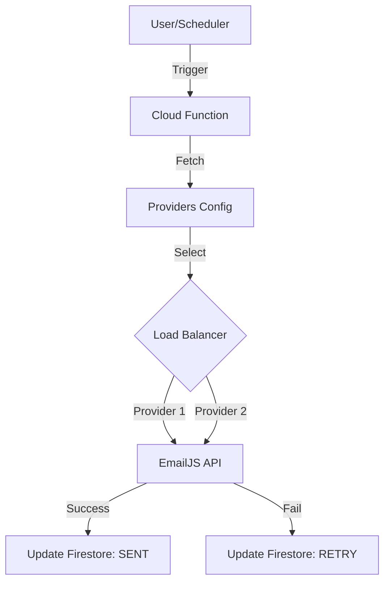

# System Flow: Email Dispatch

## Architecture

The email system uses a multi-provider fallback architecture to ensure high deliverability and redundancy.

### 1. Trigger
- **Manual**: User clicks "Send Reminder" -> Triggers Callable Cloud Function.
- **Scheduled**: CRON job (Cloud Scheduler) triggers Pub/Sub function -> Scans `scheduledReminders` collection.

### 2. Selection Logic
The system selects an EmailJS Service ID based on:
1. **Quota Usage**: Tracks daily usage per provider.
2. **Availability**: Checks active status.
3. **Randomized Load Balancing**: Distributes traffic to prevent rate limiting.

### 3. Execution
1. Function constructs payload:
   - `service_id`: Selected Provider
   - `template_id`: Dynamic Template
   - `user_id`: Public Key
   - `accessToken`: Private Key
   - `template_params`: `{ title, time, message, to_email }`
2. Function calls EmailJS REST API (`https://api.emailjs.com/api/v1.0/email/send`).

### 4. Response Handling
- **Success**: Updates `scheduledReminders` status to `sent`. Logs success.
- **Failure**:
  - Updates status to `failed`.
  - Increments `attempts`.
  - If `attempts < MAX_RETRIES`, schedules retry.
  - Logs specific error (e.g., 412 Precondition Failed, 400 Bad Request).

## Diagram

